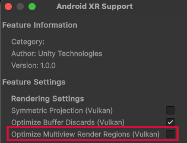

# Multiview Render Regions

This page supplements the [OpenXR multiview render regions](xref:openxr-multiview-render-regions) documentation and only contains information about APIs where Google's Android XR runtime exhibits platform-specific behavior.

## Prerequisites

To enable this feature, you need the following:

* Unity 6.1 or newer.
* Ensure that the Vulkan API is enabled. (This feature is not available on other graphics APIs.)

## Enable Multiview Render Regions

To enable the Multiview Render Regions feature:

1. Open the **OpenXR** section of **XR Plug-in Management** (menu: **Edit** > **Project Settings** > **XR Plug-in Management** > **OpenXR**).
2. Under **All Features**, enable **Android XR Support**.
3. Use the **Gear** icon to open **Android XR Support** settings.
4. Under **Rendering Settings**, enable **Optimize Multiview Render Regions**.

 *Enable the Optimize Multiview Render Regions feature in Rendering Settings.*

## Additional resources

* [OpenXR multiview render regions](xref:openxr-multiview-render-regions)
* [Multiview Render Regions](xref:um-xr-multiview-render-regions) (Unity Manual)
