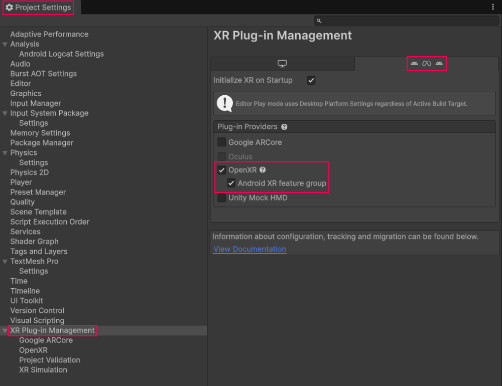
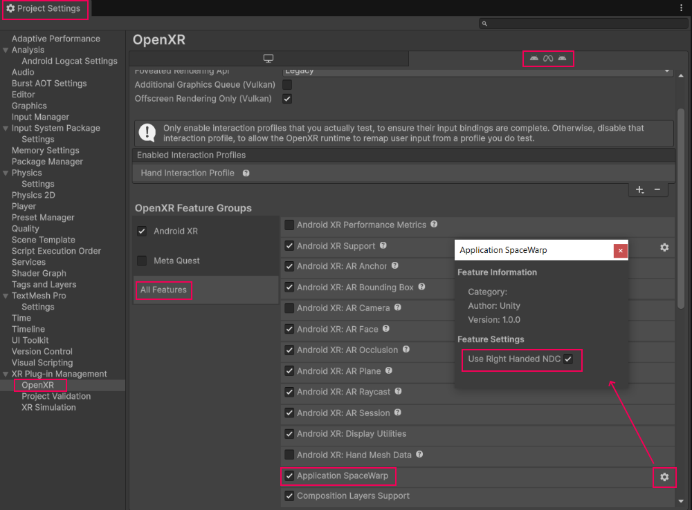

# Application SpaceWarp

Application SpaceWarp is an optimization for OpenXR that helps applications maintain a high frame rate. SpaceWarp synthesizes every other frame, which can reduce computational power and energy use considerably. The technique uses reprojection when synthesizing frames to reduce latency between the user’s movements and display updates.

Refer to [URP Application SpaceWarp](xref:um-xr-application-spacewarp) for more details on how to use SpaceWarp.

To enable this feature in a Unity project, you need the following:

* Unity 6000.1.13f1 or newer
* OpenXR 1.15.1 or newer
* Universal Render Pipeline (URP)

Refer to [Enable and use Application SpaceWarp](xref:openxr-spacewarp-workflow) for more information on how to setup SpaceWarp in your project using OpenXR.

## SpaceWarp setup

To enable SpaceWarp in your Android XR project:

1. Open the **Project Settings** window in the Unity Editor (menu: **Edit > Project Settings**).
2. Select the **XR Plug-in Management** section.
3. Choose the tab at the top corresponding to your current XR device.
4. Enable the **OpenXR** checkbox, then enable the **Android XR feature group** checkbox.

5. Underneath **XR Plug-in Management**, select **OpenXR**.
6. In the list of **OpenXR Feature Groups**, select **All Features**.
7. In the list of features, enable **Application SpaceWarp**.
8. Click the gear icon () for **Application SpaceWarp** to open its configuration window.
9. Enable **Use Right Handed NDC**.

> [!IMPORTANT]
> SpaceWarp motion vectors on Android XR devices use right-handed normalized device coordinates (NDC). You must enable the **Use Right Handed NDC** option on the **Application SpaceWarp** configuration. If this option is set incorrectly, the motion vectors will point in the wrong direction and result in erroneous warp calculations. The right-handed NDC option is only supported in Unity 6000.1.13f1+ and OpenXR 1.15.1+.