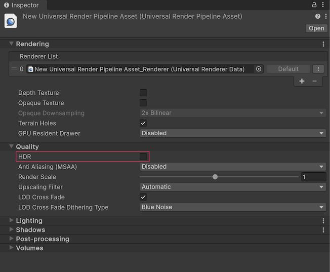
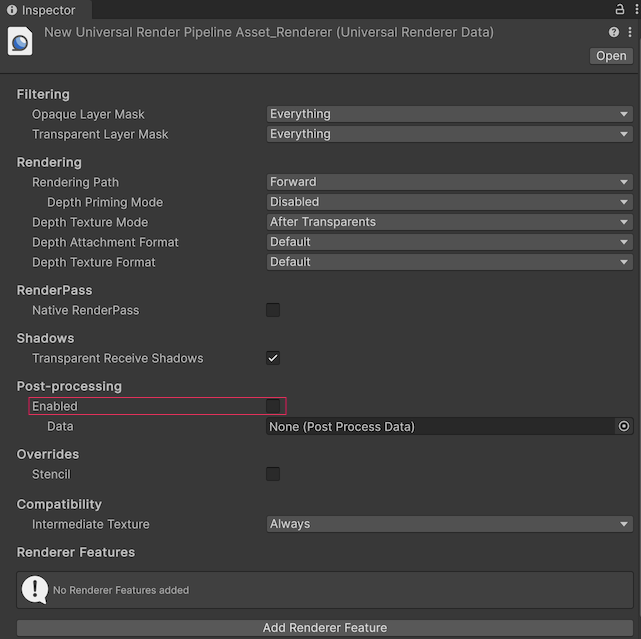

# Optimize graphics settings

Refer to the following sections to understand how to configure your graphics settings for your Android XR project.

## Vulkan Graphics API

Vulkan is the recommended graphics API for Android XR, as newer graphics features are only supported with that API.

To change your project's Graphics API to Vulkan, follow these steps:

1. Go to **Edit** > **Project Settings** > **Player**.
2. Select the Android tab and open **Other Settings**.
3. In the **Rendering** section, if **Auto Graphics API** is enabled, disable this setting to reveal the **Graphics APIs** section.
4. Under **Graphics APIs**, click the **Add** button (**+**) to add a new Graphics API.
5. Select **Vulkan**.
6. Re-order the Graphics APIs using the handles (**=**) so that **Vulkan** is listed first.
7. Optionally, select any other Graphics APIs and click the **Remove** button (**-**) to remove them.

## Universal Render Pipeline

Android XR is compatible with the Universal Render Pipeline (URP), but the default URP settings aren't suitable for best passthrough performance on Android XR. Refer to the following table for a list of Unity's recommended settings, which are explained in greater detail in the following sections.

| Setting                  | Location                                          | Recommended value |
| :----------------------- | :------------------------------------------------ | :---------------: |
| **HDR**                  | Universal Render Pipeline Asset                   |      Disabled     |
| **Post-processing**      | Universal Renderer Data                           |      Disabled     |

> [!NOTE]
> If you're using [HDR light estimation](xref:androidxr-openxr-camera) in your project, enable **HDR**. Note that this can affect the performance of your application.

### Configure URP in your project

If you created your project from a template, Unity provides multiple URP Assets for different [Quality Levels](xref:um-class-quality-settings). If you created your project from scratch, configure URP as your active render pipeline, and create the necessary URP Asset(s) as outlined in [Install URP into an existing project](xref:urp-install-urp-into-a-project).

Assign a URP asset for each active quality level for the Android platform as described in [Set URP as the active render pipeline](xref:urp-install-urp-into-a-project#set-urp-active). You can find which quality levels are active for Android in the [Quality Levels](xref:um-class-quality-settings) matrix (**Edit** > **Project Settings** > **Quality** > **Levels**).

When you configure the following settings, ensure you select the URP asset you assigned as the **Render Pipeline Asset** for the active quality level(s).

> [!NOTE]
> If your project has multiple Android XR [Quality Levels](xref:um-class-quality-settings) (**Edit** > **Project Settings** > **Quality** > **Levels**), assign a URP Asset to each quality level. The **Render Pipeline Asset** you select for each quality level overrides the asset you select in the **Graphics** settings (**Edit** > **Project Settings** > **Graphics** tab). If you assign a different URP asset to different quality levels, configure the following settings for each URP Asset.

### Universal Render Pipeline Asset settings

To optimize your Universal Render Pipeline Asset for Android XR:

1. Locate the Universal Render Pipeline Asset you assigned as the **Render Pipeline Asset**. One way to do this is to type `t:UniversalRenderPipelineAsset` into the **Project** window's search bar.
2. In the **Inspector**, under the **Quality** header, disable **HDR** for each URP Asset assigned to an Android quality level.

 *Universal Render Pipeline Asset shown with recommended settings.*

### Universal Renderer Data settings

To optimize your Universal Renderer Data for Android XR:

1. Locate your project's Universal Renderer Data Asset. One way to do this is to type `t:UniversalRendererData` into the **Project** window's search bar.
2. In the **Inspector**, under the **Post-processing** header, uncheck **Enabled** for each URP Asset assigned to an Android quality level.

 *Universal Renderer Data shown with recommended settings.*

## Additional resources

* [Optimization techniques for untethered XR devices](xref:urp-xr-untethered-device-optimization) (Unity User Manual)
* [Permissions](xref:androidxr-openxr-permissions)
