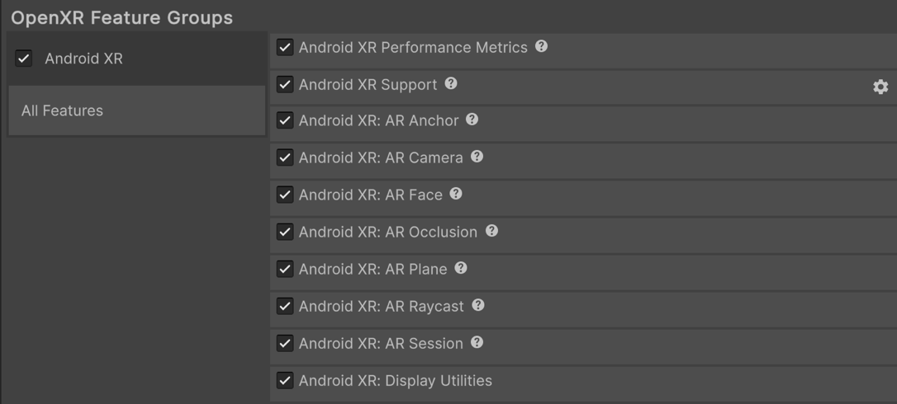
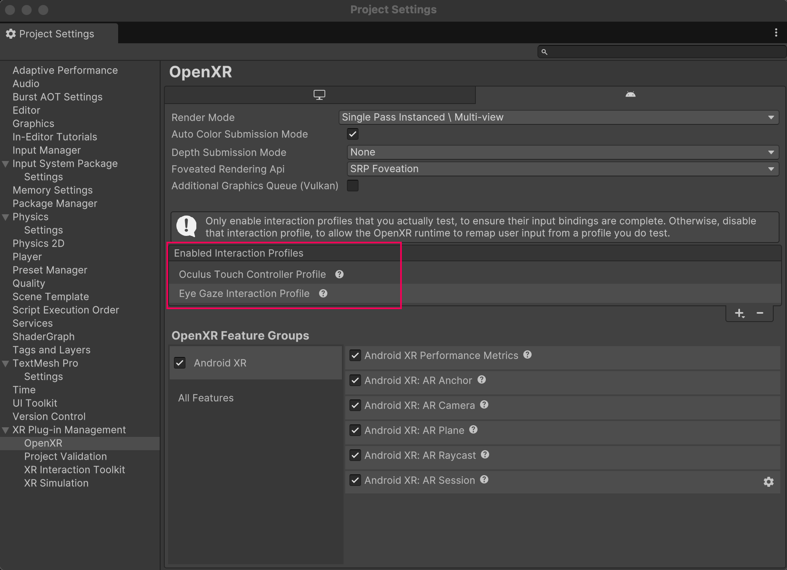

# Configure project settings

Understand how to configure your Android XR project.

Once you have [installed Android XR](xref:androidxr-openxr-installation), use the **Project Settings** window to enable Android XR features and configure interaction profiles.

## Prerequisites

You must have the Android module installed in the version of the Unity Editor you're using. Refer to [Add modules](https://docs.unity3d.com/hub/manual/AddModules.html) for more information.

## Android XR build platform and build profile

In Unity 6.1 and newer, you can use the Android XR build platform and build profile to configure your Android XR project.

To learn more about the Android XR build platform and build profile, refer to [Develop for Android XR workflow](https://docs.unity3d.com/6000.1/Documentation/Manual/xr-android-xr-develop.html) in the Unity User Manual.

## Enable Unity OpenXR: Android XR

To enable Unity OpenXR: Android XR in your project, follow these steps:

1. Go to **Edit** > **Project Settings** > **XR Plug-in Management**. If you don't already have it installed, click **Install XR Plug-in Management**.
2. In the Android tab, under **Plug-in Providers**, enable **OpenXR**.
3. While still in the **Project Settings** window, go to **XR Plug-in Management** > **OpenXR**.
4. Under **OpenXR Feature Groups**, enable the **Android XR** feature group.
5. When you enable the Android XR feature group, Unity automatically enables some features. To enable only the features relevant to your project, click on the **Android XR** feature group, and select the relevant features.

> [!IMPORTANT]
> You must enable the **Android XR: AR Session** feature for [AR features](xref:androidxr-openxr-ar-features) in your project to work correctly.

 *The Android XR OpenXR feature group, shown with all features enabled.*

> [!NOTE]
> XR Plug-in Management supports only one enabled plug-in provider at a time per build target. If your project also targets ARCore using the [Google ARCore XR Plug-in](https://docs.unity3d.com/Packages/com.unity.xr.arcore@6.2/manual/index.html), to avoid errors you should disable the **Google ARCore** plug-in provider in the Android tab of **Project Settings** > **XR Plug-in Management** before you build an APK for Android XR devices. Likewise, you should disable **OpenXR** before you build for ARCore.

## Configure interaction profiles

For Android XR projects using controller input, you should add the [Oculus Touch Controller Profile](xref:openxr-oculus-touch-controller-profile). If you're using [Eye tracking and foveated rendering](xref:androidxr-openxr-foveated-rendering) features in your project, you should also add the [Eye Gaze Interaction profile](xref:openxr-eye-gaze-interaction).

To add the Oculus Touch Controller Profile and the Eye Gaze Interaction profile:

1. Go to **Edit** > **Project Settings** > **XR Plug-in Management**.
2. In the Android tab, under **Plug-in Providers**, enable **OpenXR**.
3. While still in the **Project Settings** window, go to **XR Plug-in Management** > **OpenXR**.
4. In the Android tab, under **Enabled Interaction Profiles**, add **Oculus Touch Controller Profile** and **Eye Gaze Interaction profile**.

 *The Oculus Touch Controller Profile and Eye Gaze Interaction Profile are enabled.*

## Enable run without focus

Enable **Run Without Focus** to keep your application running even when it's not in focus but is visible, such as on devices supporting split-screen mode. **Run Without Focus** is disabled by default when you create a project from scratch. When disabled, the application pauses but remains visible.

> [!IMPORTANT]
> Enable this setting if your project uses the Input System [Tracked Pose Driver](xref:UnityEngine.InputSystem.XR.TrackedPoseDriver) component. Without **Run Without Focus** enabled, you might encounter headlock issues in your project.

Refer to [Android Build Settings](xref:um-class-player-settings-android) for more information.

## Enable resizeable activity for pop-up windows

Most Android XR apps require the activity window to be resizable so the device can render pop-ups, such as system permission requests.

To make sure the device renders pop-up windows correctly, enable [Resizeable Activity](xref:um-class-PlayerSettingsAndroid#Resolution) (**Edit** > **Project Settings** > **Player** > **Android** tab > expand **Resolution and Presentation**). (In earlier versions of Unity, this setting was named **Resizable Window**.)

## Additional resources

* [Scene setup](xref:androidxr-openxr-scene-setup)
