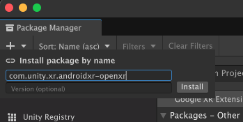

# Install Android XR

This pages lists the technical requirements for Android XR. You can install the package from the Package Manager.

## Requirements

To use the Unity OpenXR: Android XR package, your project must meet the following requirements:

* Unity 6000.0.23f1 or newer (Unity 6000.1.10f1 is recommended)
* [Android Build Support](xref:um-android-install-dependencies) module
* AR Foundation 6.2.0 or newer
* OpenXR 1.15.0 or newer
* XR Hands 1.6.0 or newer

When you install this package, if you don't already have AR Foundation or OpenXR in your project, the Package Manager automatically installs these dependencies.

> [!NOTE]
> If you add the [Android XR build profile](xref:androidxr-openxr-project-setup#build-profile) in Unity 6.1 and newer, Unity automatically installs the latest compatible version of the Unity OpenXR: Android XR package.

## Install Unity OpenXR: Android XR

Unity OpenXR: Android XR is an official Unity package available via the [Package Manager](xref:um-upm-ui).

To install the Android XR package from the Package Manager:

1. Create a new Unity project or open an existing one.
2. Click the link: [com.unity.xr.androidxr-openxr](com.unity3d.kharma:upmpackage/com.unity.xr.androidxr-openxr).

   The Unity Package Manager window opens with the package name entered in the **Add package by name** dialog.

   

3. (Optional) Enter the full version number, such as <code class="long_version">X.Y.Z</code>, to install. If left blank, Unity chooses the "best" version. This is typically the latest release version for the current Unity Editor. Refer to the [Changelog](xref:androidxr-openxr-changelog) for a list of versions available at the time this documentation page was published.
4. Click **Add** to add the package to your project.

## Additional resources

* [Get started](xref:androidxr-openxr-get-started)
* [Install a UPM package from a registry](xref:um-upm-ui-install)
