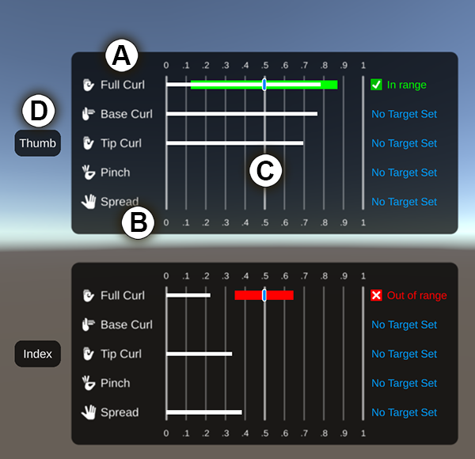

# Understand the Gesture Debugger

The gesture debugging scene shows three types of information:

* **Hand Shape Debugger** displays the current values of the finger shapes for every finger. This display includes the target value and tolerance ranges for the configured hand shape. You can [change the configured hand shape](xref:xrhands-customize-gesture-debugger#set-hand-shape) so that the values for the selected hand shape you are testing or debugging are shown in the finger graphs for the given hand.
* **Hand Pose Debugger** shows whether specific hand poses are currently recognized. You can [replace or add to](xref:xrhands-customize-gesture-debugger#set-hand-pose) the list of recognized hand poses by editing the scene.
* **Advanced Pose Debugger** combines data from both the Hand Shape Debugger and Hand Pose Debugger. It displays the current or last recognized hand pose along with target values and tolerance ranges for each finger shape.

**HandGestures** is a sample scene provided as part of the **Gestures** sample that you can import from the XR Hands package. Refer to [Install the gesture debugger](xref:xrhands-install-gesture-debugger) for instructions.

## Hand Shape Debugger
 <i>The hand shape debugger scene visualizing a gesture</i>

To use the Hand Shape Debugger:

* In the HandGestures scene, enable the **Hand Shape Debugger** prefab, and disable the Hand Pose Debugger prefab.

### Hand Shape Debugger: Finger data display

The finger data display shows the current value for each aspect of a finger's shape. For the configured `XRHandShape` asset, the display also shows the target value and the upper and lower values of the tolerance range for each aspect. You can change the configured `XRHandShape` asset in the debugger by selecting a different asset in the inspector. Refer to [Set the HandShape](xref:xrhands-customize-gesture-debugger#set-hand-shape) for more information.

 *An example of the data displayed for a finger state*

The following table describes each part of the data graph:

|     | Description |
| :-- | :---------- |
| A | The names of the shape values. |
| B | The numeric scale, which is a normalized range between zero and one. |
| C | The finger shape data:  <ul><li><b>White line</b>: The current value of the shape based on the incoming joint data from the hand tracking system.</li><li><b>Marker</b>: The target value of the configured HandShape asset.</li><li><b>Green or Red line</b>: The upper and lower values of the tolerance range around the target value. The line turns green when the current finger shape value is within the tolerance range and red when it is not.</li></ul> |
| D | The name of the finger. |

Refer to [Finger shapes](xref:xrhands-finger-shapes) for information about the shape values. Refer to [Hand shapes](xref:xrhands-hand-shapes) for information about creating and editing `XRHandShape` assets.

### Hand Shape Debugger: Hand shape completeness

The hand shape completeness bar shows how closely the current hand shape matches a predefined target hand shape. To activate the completeness UI, enable the **Hand Shape Debugger** prefab and ensure its child, **Shape Completeness**, is also enabled.

Once enabled, progress bars appear below the hand shape icons. The filled status of these bars provide real-time feedback on hand-shape accuracy based on the calculated completeness score, where 0% indicates no match and 100% indicates a match. Refer to [Hand Shape Completeness Calculator](xref:xrhands-handshape-completeness-calculator) for more information.

 *The progress bar shows the left hand performing an incomplete grab shape and the right hand performing a full grab shape.*

> [!TIP]
> You can define a custom method to calculate the hand shape completeness. See more details in [Hand Shape Completeness Calculator](xref:xrhands-handshape-completeness-calculator#customize-the-completeness-calculation-method).

## Hand Pose Debugger: Gesture detection

To use the Hand Pose Debugger:

* In the HandGestures scene, enable the **Hand Pose Debugger** prefab, and disable the Hand Shape Debugger prefab.

The gesture detection section of the Hand Pose Debugger provides indicators that change color when one of the configured `XRHandPose`s is detected. You can change the configured `XRHandPose` or add to the list by editing the debugger scene. Refer to [Edit the gesture list](xref:xrhands-customize-gesture-debugger#set-hand-pose) for more information.

 <i>The preconfigured sample hand poses provided by the HandGestures sample</i>

> [!TIP]
> To see the target values and tolerances for a gesture's finger shapes, you can [edit the scene](xref:xrhands-customize-gesture-debugger#set-hand-shape) so that the finger data display references the same `XRHandShape` asset as the hand pose you are interested in.

## Advanced Pose Debugger

To use the Advanced Pose Debugger:

* In the HandGestures scene, enable the **Advanced Pose Debugger** prefab, and disable both the Hand Shape Debugger and the Hand Pose Debugger prefab.

The Advanced Pose Debugger combines features from both the Hand Pose Debugger and the Hand Shape Debugger, offering a more advanced tool for hand pose analysis.

The gesture detection section of the Advanced Pose Debugger provides indicators that change color when one of the configured `XRHandPose`s is detected. You can change the configured `XRHandPose` or add to the list by editing the debugger scene. Refer to [Edit the gesture list](xref:xrhands-customize-gesture-debugger#set-hand-pose) for more information.

 <i>The preconfigured sample hand poses provided by the HandGestures sample, visualized by the Advanced Pose Debugger.</i>
